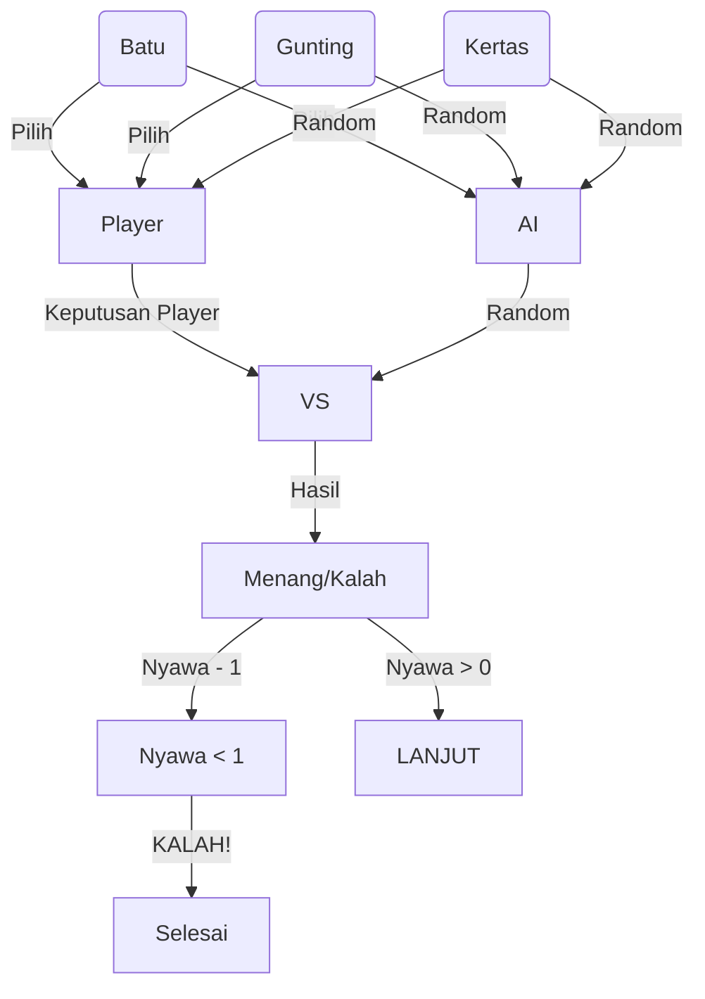

# Man vs AI

## Flow

- **Player** memiliki 10 *Nyawa* di awal permainan.
- **AI** memiliki 10 *Nyawa* di awal permainan.
- **Player** akan memilih antara *Batu*, *Gunting*, dan *Kertas*.
- **AI** akan memilih antara *Batu*, *Gunting*, dan *Kertas* secara acak.
- Hasil yang dipilih **Player** dan **AI** akan dibandingkan dengan ketentuan:
    - Batu vs Kertas, *Kertas* menang.
    - Gunting vs Kertas, *Gunting* menang.
    - Batu vs Gunting, *Batu* menang.
- *Nyawa* pihak yang kalah akan berkurang 1.
- Siapapun yang pertama kali *Nyawa*nya mencapai 0, ia yang kalah, dan Game Over.

## Materi
Ini adalah project untuk mempraktekan pelajaran dasar Javascript.
- Variable, operators.
- Data types, logical operators, conditionals, nesting.
- DOM.
- Functions.
- Problem solving.
- Types of errors.
- Clean code.
- Installing node, nvm
- Arrays, Loops.
